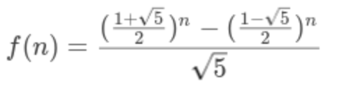

# 斐波那契数列
斐波那契数列：又称黄金分割数列、因数学家列昂纳多·斐波那契（Leonardoda Fibonacci）以兔子繁殖为例子而引入，故又称为“兔子数列”，指的是这样一个数列：1、1、2、3、5、8、13、21、34、……。    
在数学上，斐波纳契数列以如下被以递推的方法定义：F(1)=1，F(2)=1, F(n)=F(n-1)+F(n-2) (n>=3，n∈N*)

- **递归实现**

```javascript
function fibo(n){
  if(n<=1){
    return n;
  }else{
    return fibo(n-1)+fibo(n-2);
  }
}
```
总结：实现简洁明了，但是时间复杂度几乎是指数级的上涨，n数值大一点，就会导致栈溢出，因为每次fibo计算的结果都没有进行缓存，这样会导致在计算fibo(n)时，n之前的都会进行计算。

- **递归实现（优化：缓存已计算的结果）**

```javascript
function fibo(n,array_cache){
  if(n<=2){
    return 1;
  }else{
    // 初始化，因为数列的下标是0，所以数组0的下标对应的值存为0
    if(array_cache === undefined){ array_cache = [0,1,1]; }
    array_cache[n] = fibo(n-1, array_cache) + array_cache[n-2];
    return array_cache[n];
  }
}
```
总结：效率可以，时间复杂度为O(n)。避免了重复进行计算，但是逻辑依旧是有点复杂，不简洁

- **循环实现**

```javascript
function fibo(n){
  if(n<=2){
    return 1;
  }
  var preVal = 1; // n-1，初始化值为1
  var prePreVal = 1; // n-2，初始化为1
  var rst = preVal + prePreVal;
  for(var i=3; i<n; i++){
    prePreVal = preVal;
    preVal = rst;
    rst = preVal + prePreVal;
  }
  return rst;
}
```
总结：效率可以，时间复杂度为O(n)。

- **通项公式解法**
     

```javascript
function fibo(n){ 
  // 利用公式来计算，但是要注意js里面的小数点，所以要用toFixed进行四舍五入，所以最好返回的是字符串数值
  return ((Math.pow((1+Math.sqrt(5))/2 , n) - Math.pow((1-Math.sqrt(5))/2 , n))/Math.sqrt(5)).toFixed(0); 
}
```
总结：简洁，但是前提是得知道通项公式
