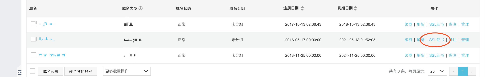
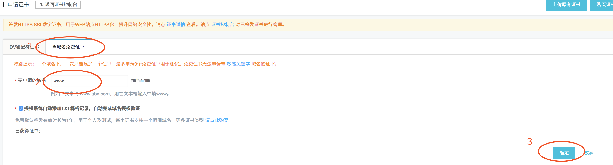
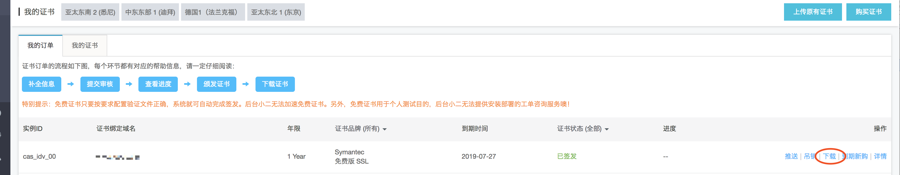
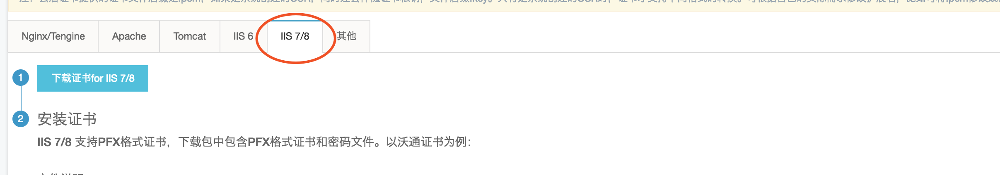
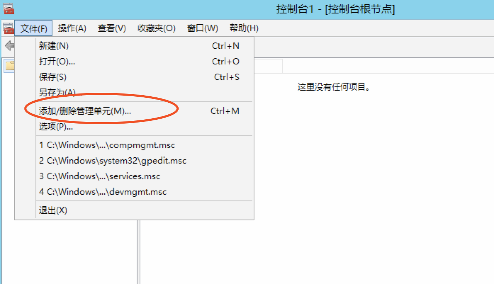
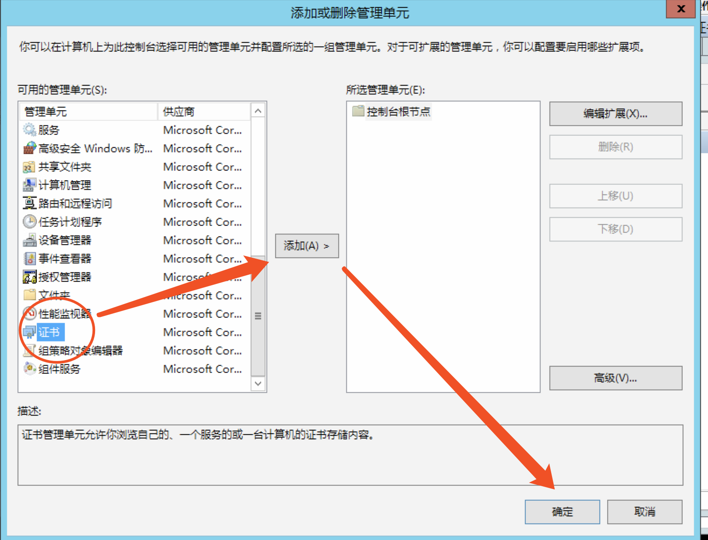
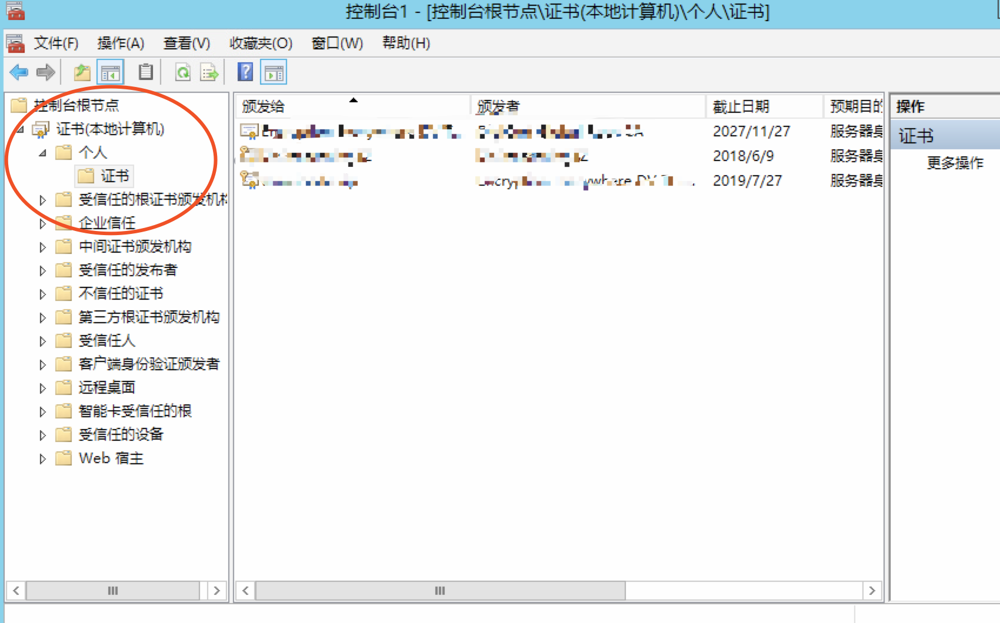
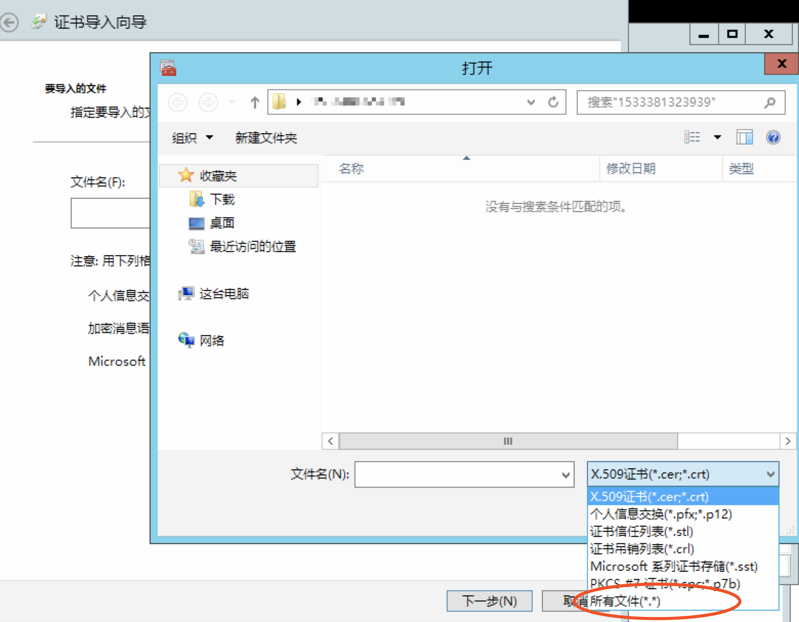
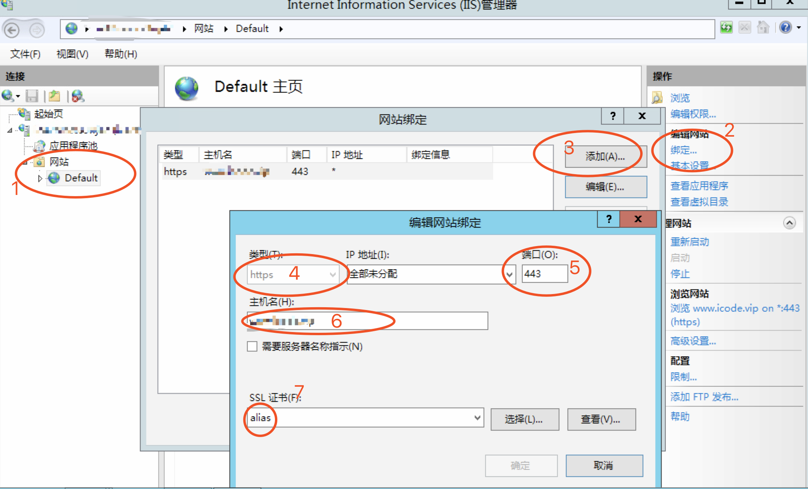

# 配置HTTPS记录

涉及到阿里云的产品（如果找不到相关产品，可以直接在阿里云中搜索）：
- 域名
- SSL证书（应用安全）

步骤如下：

1. 阿里云 -> 控制台 -> 域名，选择对应域名的SSL证书

2. 申请免费的SSL证书

3. 阿里云 -> 控制台 -> SSL证书（应用安全），就可以看到刚刚申请的SSL证书了，之后打开下载

4. 选择对应的服务器类型，我这里用的是IIS8，直接选择IIS7/8，单击下载即可。（下载的压缩包里包括了证书和密码文件）

5. 在windows服务器上，win+r（运行）输入mmc，然后如下图，打开菜单：文件-> 添加/删除管理单元

6. 左侧列表中选择“证书”，添加到右侧，并保存；

7. 然后选择：证书 -> 个人 -> 证书；在右侧，右击鼠标：所有任务 -> 导入

8. 选择后缀为.pfx的文件，并且输入pfx-password.txt中的密码，再确定即可

9. 打开iis管理器，根据下图顺序进行操作，选择需要绑定证书的站点 -> 绑定 -> 添加 -> 选择https、端口443、输入主机名：www.yourdomainname.com、选择alias证书，最后确定即可。

此时在浏览器中直接访问:https://www.yourdomainname.com就行了。
