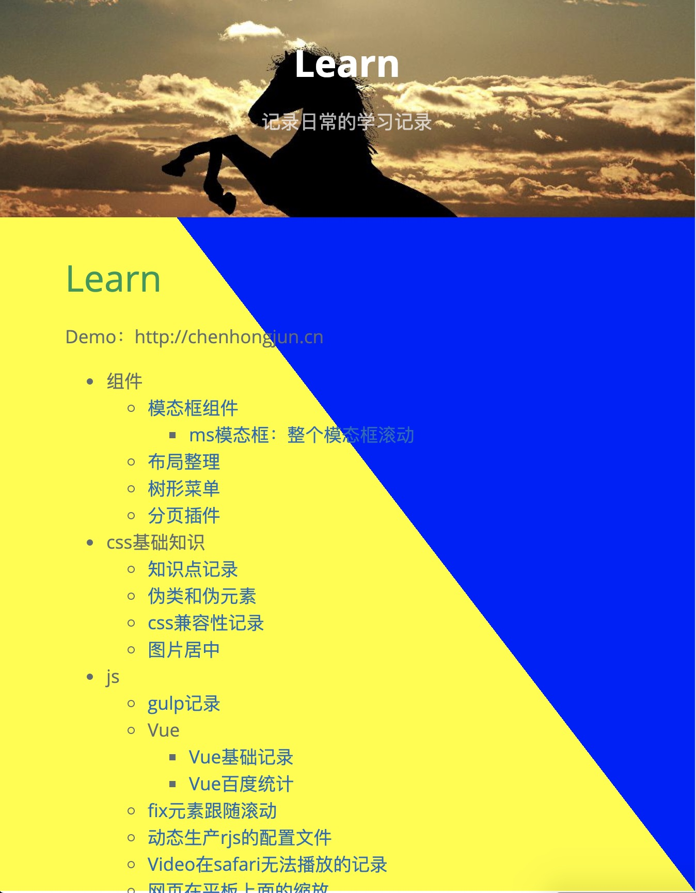

# css知识点
#### height属性记录
1. 当子元素的height:100%时，100%是从父元素继承而来，如果父元素未指定高度，此时高度就是0，所以如果想要body的height:100%生效，html的height也必须设置成100%；  


2. 当元素只设置min-height时，子元素设置height:100%时是无效的，因为子元素的height:100%是继承父元素的height，但是min-heights是在height生效之后才会起作用；


3. 页面body中有3个元素  
   div1 -> height:100px;   
   div2 -> height:100px;  
   div3 -> height:100%;  
   此时，**html和body必须同时都为100%**时，div3的高度才会是100%，否则div3的高度是0；或者body的高度设置为100px时，div3的高度则也是100px;
---
#### border-1px（四边）记录
注意点：伪类的border-radius是元素本身的2倍
```css
.border-1px{
     margin:20px;
     width:100px;
     height:20px;
     background:#ccc;
     position:relative;
     border-radius: 2px;
  }
  .border-1px::before{
     content: '';
     position:absolute;
     top:0;
     right:0;
     bottom:0;
     left:0;
     width:200%;
     height:200%;
     border: 1px solid red;
     box-sizing: border-box;
     transform: scale(0.5);
     transform-origin: left top;
     border-radius: 4px;
  }
```
----
#### css实现滚动进度条
注意：当body中有背景图时，会覆盖住顶部显示的进度条，可以通过设置body的padding-top预留好顶部位置来避免这个问题。    
`background-image: linear-gradient(to right top, yellow 50%, blue 50%);`效果图如下（留意黄蓝的位置）：


```css
body{
 /* 设置背景颜色从左上角到右下角的对角方向，第一个颜色是开始颜色，第二个是结束颜色，后面百分比是渐变位置 */
 background-image: linear-gradient(to right top, yellow 50%, blue 50%);
 /* 加上滚动条的高度 */
 background-size:100% calc(100% - 100vh + 5px);
 background-repeat: no-repeat;
}

body::after {
 content: "";
 position: fixed;
 top: 5px;
 left: 0;
 bottom: 0;
 right: 0;
 background: #fff;
 z-index: -1;
}
```
