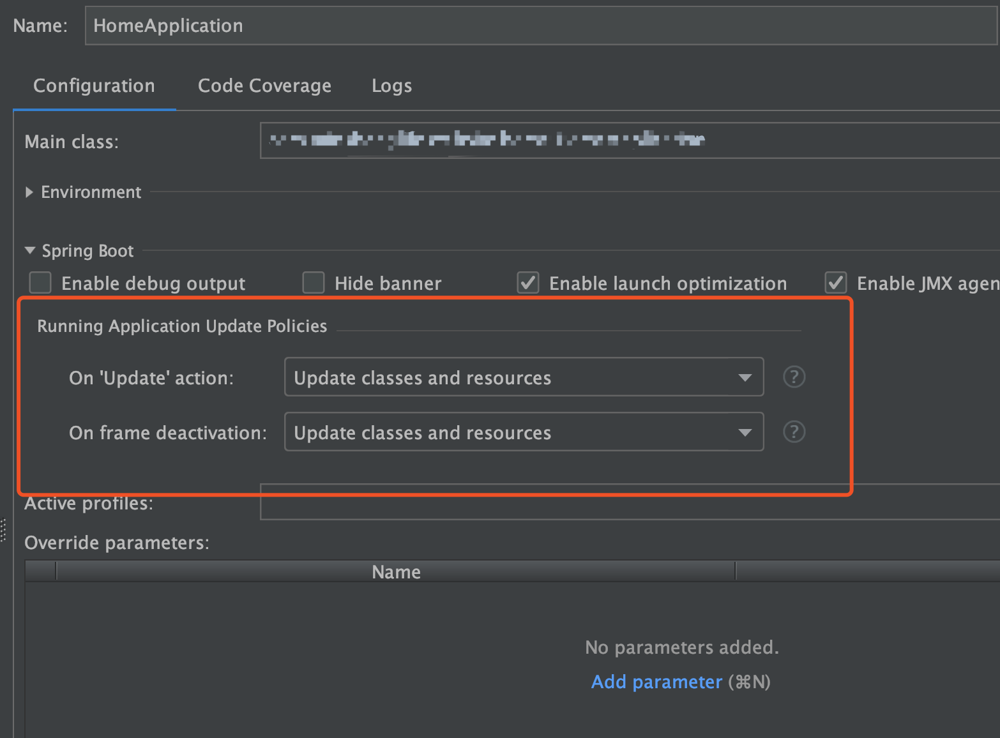
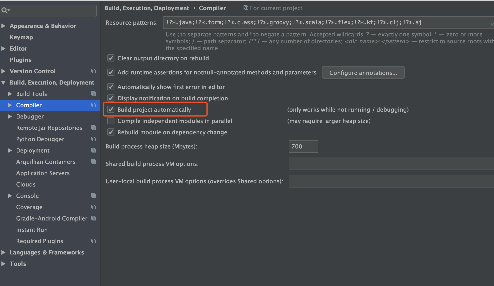
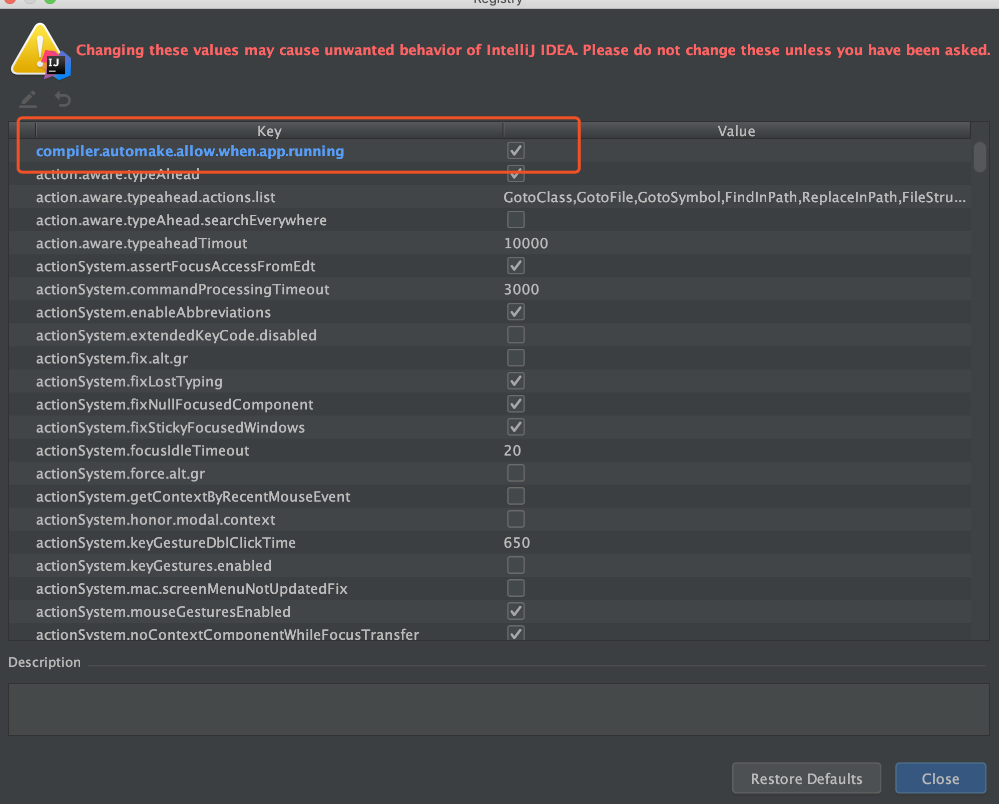

# IDEA自动更新设置记录

1.项目配置：Edit Configurations

2.IDEA：Preferences...

3.IDEA：Help -> Find action    
先输入：Registry...，然后根据下面的进行设置即可

4.如果要设置Thymeleaf，需要在application.yml中配置spring.thymeleaf.cache=false (如果不设置，默认是true)
  
